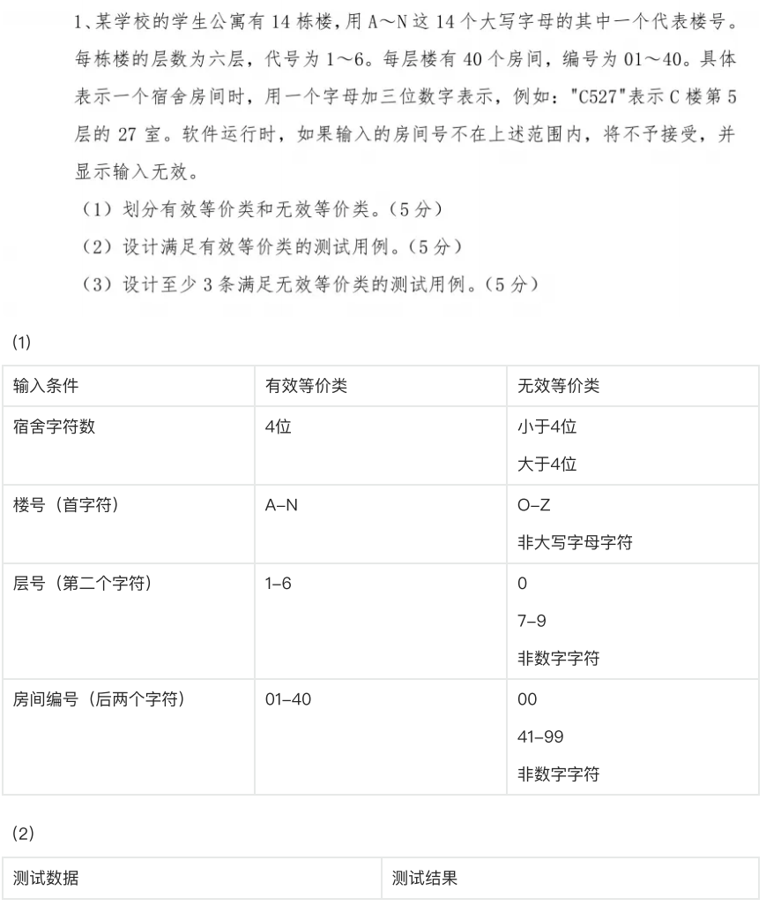
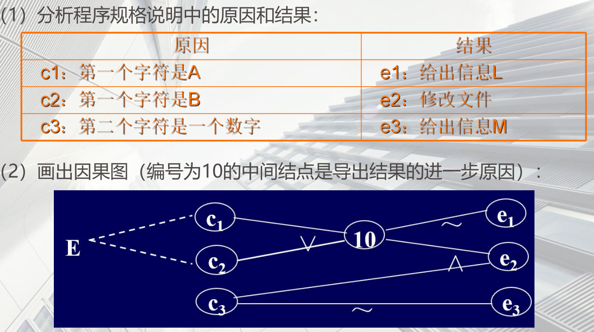
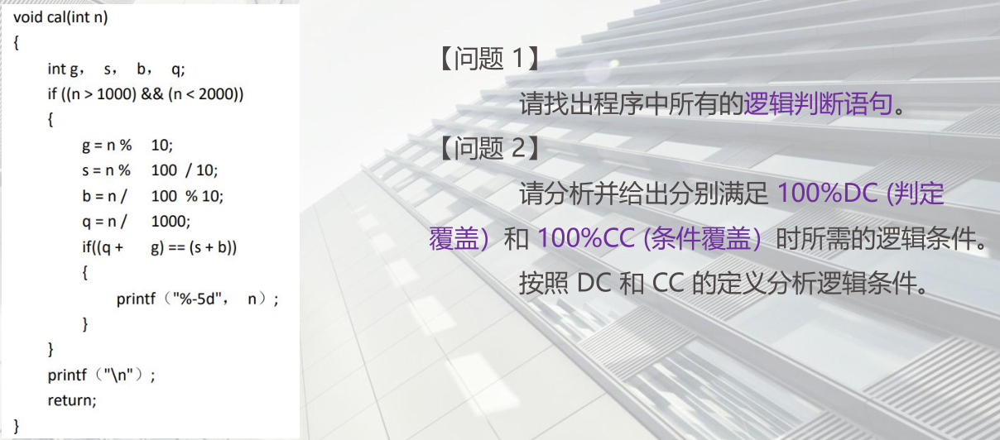
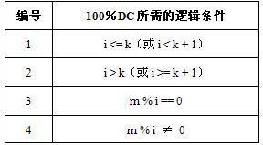
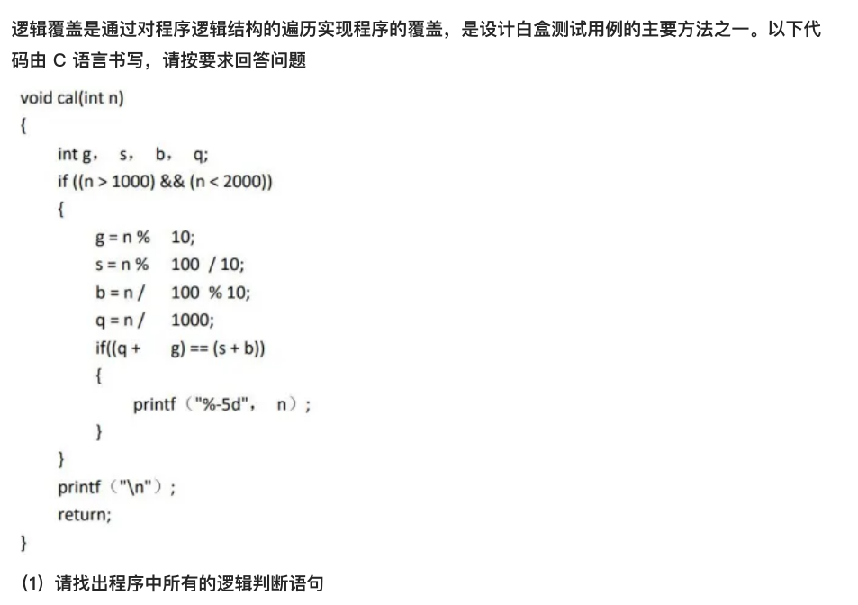

## 黑盒测试

### 等价类划分答题步骤：

1.首先文字说明等价类如何划分

2.列等价类表

| 输入条件 | 有效等价类 | 编号 | 无效等价类 | 编号 |
| -------- | ---------- | ---- | ---------- | ---- |
|          |            |      |            |      |
|          |            |      |            |      |

3.写测试用例，尽量覆盖多的有效等价类

4.写测试用例，每次仅覆盖一个无效等价类

写出测试用例表

| 测试用例编号 | 输入数据 | 预期输出 | 覆盖的等价类编号 |
| ------------ | -------- | -------- | ---------------- |
|              |          |          |                  |
|              |          |          |                  |

**等价类划分**


**有效等价类的测试用例**


**无效等价类的测试用例**


####  例题1




#### 例题2


### 边界值分析答题步骤：

1.首先要进行等价类划分，找到等价类的边界

2.每次保留一个变量，让其余的变量取正常值，被保留的变量依次取min、min+、nom、max-和max。     

3.若是要求健壮性边界值分析法写测试用例，变量依次取min-、min、min+、nom、max-和max、max+。

4.写测试用例

| 测试用例编号 | 变量1 | 变量2 | 变量3 | 预期输出 |
| ------------ | ----- | ----- | ----- | -------- |
| Test1        | min-  | nom   | nom   |          |
| Test2        | min   |       |       |          |
| Test3        | min+  |       |       |          |
| Test4        | nom   |       |       |          |
| Test5        | max-  |       |       |          |
| Test6        | max   |       |       |          |
| Test7        | max+  |       |       |          |
| Test8        |       |       |       |          |

####  例题1：

某数据处理系统要求⽤户输⼊⽣⽇的⽇期，⽇期限制在2003年1⽉⾄2008年12⽉，即系统只能对该期间

内的⽣数据进⾏处理，如⽇期不在此范围内，则显示输⼊错误信息边界值分析法设计的测试⽤例

 


#### 例题2：


#### 例题3：


### 决策表法答题步骤：

1.首先文字说明所有的条件和动作

2.写出决策表，注意包含“不可能”的动作

3.简化决策表


4.根据决策表写测试用例

| 测试用例编号 | 输入数据 | 预期输出 |
| ------------ | -------- | -------- |
|              |          |          |

 

#### 例题1


（1） 

(2)


#### 例题2

问题描述:“……对于功率⼤于50⻢⼒的机器，并且维修记录不全或已运⾏10年以上的机器，应给予优先的维修处理……”
条件桩:
C1：功率⼤于50⻢⼒吗?
C2：维修记录不全吗?
C3：运⾏超过10年吗?

动作桩：
A1：进⾏优先处理
A2：作其他处理⽣成判定表如下图所示。


问题：以上判定表存在冗余，请简化。

答案：


#### 例题3


### 因果图法答题步骤：

1.首先文字说明哪些是原因，哪些是结果

2.画因果图，并在因果图上标记约束关系

3.根据因果图写决策表

4.简化决策表

5.根据决策表写测试用例

| 测试用例编号 | 输入数据 | 预期输出 |
| ------------ | -------- | -------- |
|              |          |          |

 

#### 因果图生成测试用例

1. 分析软件规格说明中哪些是原因（即输⼊条件或输⼊条件的等价类），哪些是结果（即输出条件），并给每⼀个原因和结果赋予⼀个标识符。
2. 分析软件规格说明中的语义，找出原因与结果之间、原因与原因之间的对应的关系，根据这些关系画出因果图。
3. 由于语法或环境的限制，有些原因与原因之间、原因与结果之间的组合情况不可能出现。为表明这些特殊情况，在因果图上⽤⼀些记号表明约束或限制条件。
4. 把因果图转换为决策表，根据决策表中的每⼀列设计测试⽤例。

#### 例题1


#### 例题2

程序的规格说明要求：输入的第一个字符必须是A或B，第二个字符必须是一个数字，此情况下进行文件的修改；如果第一个字符不是A或B，则给出信息L，如果第二个字符不是数字，则给出信息M。




### 场景法（考试不考）


## 白盒测试


### 逻辑覆盖法答题步骤：

1.首先根据题意给出程序流程图的路径编号

2.对每个判定里的每个条件给出标记，并给出编号

A>=10&&B<=20

A>=10   T1  A<10  T2  B<=20  T3  B>20  T4  T1T3  T1T4  T2T3  T2 T4

3.写出测试用例：

| 测试用例编号 | 输入数据 | 执行路径 | 覆盖条件 | 覆盖组合号 |
| ------------ | -------- | -------- | -------- | ---------- |
|              |          |          |          |            |
|              |          |          |          |            |

 


#### 例题1

【说明】逻辑覆盖是通过对程序逻辑结构的遍历实现程序的覆盖，是设计白盒测试用例的主要方法之一。以下代码由 C 语言书写，请按要求回答问题。




#### 例题2

【说明】逻辑覆盖法是设计白盒测试用例的主要方法之一，它是通过对程序逻辑结构的遍历实现程序的覆盖。针对以下由 C 语言编写的程序，按要求回答问题。


【问题 1】
请找出程序中所有的逻辑判断子语句。
【答案】
程序中的逻辑判断子语句如下：
i<=k
m%i==0
i>=k+l




#### 例题3


#### 例题4




#### 例题5


### 基本路径测试方法答题步骤：


1.画出控制流图（非常重要，这步错，后面全错）

2.计算环形复杂度

3.写出基本路径集

4.根据路径集写测试用例

| 测试用例编号 | 输入数据 | 预期输出 | 基本路径 |
| ------------ | -------- | -------- | -------- |
|              |          |          |          |
|              |          |          |          |


####  程序的控制流图


 **例题1**

**例题2**

```
• 1、int testCov(int a , int b)
• 2、 {
• 3、 int s;
• 4、 s=1;
• 5、 if(a > 1 || b < 0 )
• 6、s = a + b;
• 7、 else
• 8、if(a < = -1)
• 9、s = a - b;
• 10、else
• 11、s = a * b;
• 12、 s = s + 1;
• 13、 return s;
• 14、 }
```


**例题3**

```
1 if (a||b)
2 x=5;
3 else
4 y=10
5 …
```


**例题4**


####  控制流图矩阵

控制流图表示成矩阵的形式，称为控制流图矩阵。一个图形矩阵是一个方阵，其行列数目为控制流图中的结点数，行列依次对应到一个被标识的结点，矩阵元素对应到结点间的连接。控制流图的结点用数字标识，边用字母标识，第i结点到第j结点有x边相连接，则对应的图形矩阵中第i行与第j列有一个非空的元素x。

##### 例题

（1）控制流图转化为控制流图矩阵


（2）控制流图矩阵转化为连接矩阵


#### 圈复杂度

圈复杂度为程序逻辑复杂性提供定量的测度，该度量用于计算程序的基本独立路径数目，确保所有语句至少执行一次的测试数量的上界。

下面介绍三种计算控制流图的圈复杂度的方法。


#### 综合例题1

实例1：以一个简单的 C 函数为例，说明使用基本路径测试法设计测试用例的过程


#### 例题2


## 性能测试

#### 例题1


#### 例题2


#### 例题3


