## 软件缺陷

#### 软件缺陷定义   

软件缺陷就是软件产品中存在的问题，最终表现为⽤户所需要的功能没有完全实现，不能满⾜或不能全部满⾜⽤户的需求。

#### 缺陷表现形式

- 1. 设计不合理，不是⽤户所期望的⻛格、格式 

- 2. 部分实现了软件某项功能 

- 3. 系统崩溃，界⾯混乱 

- 4. 数据结果不正确，精度不够 

- 5. 存取时间过⻓、界⾯不美观

#### 软件缺陷四规则

- 1. 软件未达到软件规格说明书中规定的功能 

- 2. 软件出现了产品说明书中指明不会出现的错误 

- 3. 软件功能超出了产品说明书中指明的范围 

- 4. 软件测试⼈员认为软件难于理解，不易使⽤，运⾏速度慢，或者最终⽤户认为软件使⽤效果不好

#### 缺陷报告

当测试人员发现缺陷后,需要填写缺陷报告来记录这些缺陷,并通过缺陷报告告知开发人员所发生的问题。缺陷报告是测试人员和开发人员交流沟通的重要工具。

##### 组成

标题、操作步骤、期望结果、实际结果等

##### 案例

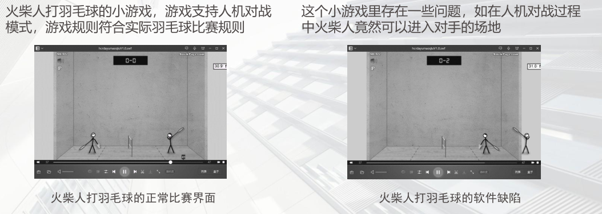
**缺陷名称**：在竞赛的时候，按up+right导航键，火柴人进入对手的场地
**前置条件**：运行火柴人打羽毛球的游戏。选择Advanced Mode。
**详细描述**（复现步骤)：单击Play。单击Down 导航键发球。在竞赛的过程中，单击UP + Right 导航键，查看火柴人的位置。长按Right导航键，查看火柴人的位置。
**预期结果**：R3：火柴人应该在左侧竞赛区域，不能进入对手的场地。R4：火柴人应该紧贴在网的左侧，不能进入对手的场地，不能离开界面显示区域。
**实际结果**：R3：火柴人能够跳跃到对手场地。R4：火柴人从右边离开界面显示。

#### 缺陷严重等级

0 级：致命(Fatal)
最严重等级，此等级的缺陷会导致系统任何一个主要功能完全丧失、用户数据受到破坏、系统崩溃、悬挂、死机等
1 级：严重(Critical)
系统的主要功能部分丧失、数据不能完整保存，系统的次要功能完全丧失，系统所提供的功能或服务受到明显的影响
2 级：一般(Major)
系统的次要功能没有完全实现，但不影响用户的正常使用。例如：提示信息不太准确，或用户界面差、操作时间稍长等问题
3 级：提示(Minor)
操作者不方便或遇到麻烦，但不影响功能的操作和执行，如文字不美观、按钮大小不是很合适、文字排列不齐等一些小问题


## 软件测试

#### 软件开发与软件测试

软件开发与软件测试都是软件项⽬中⾮常重要的组成部分，软件开发是⽣产制造软件产品，软件测试是检验软件产品是否合格，两者密切合作才能保证软件产品的质量。

#### 软件测试定义

使用人工或自动手段,运行或测定某个软件系统的过程,目的在于检验它是否满足规定的需求或弄清预期结果与实际结果之间的差别。

#### 软件测试⽬的

在于检验它是否满⾜规定的需求或弄清预期结果与实际结果之间的差别。

#### 软件测试原则

- 1. 应当把“尽早地和不断地进⾏软件测试”作为软件开发者地座右铭

- 2. 测试⽤例应由测试输⼊数据和与之对应地预期输出结果两部分组成

- 3. 程序员应避免检查⾃⼰的程序

- 4. 在设计测试⽤例时，应当包括合理的输⼊条件和不合理的输⼊条件

- 5. 充分注意测试中的群集现象

- 6. 严格执⾏测试计划，排除测试的随意性

- 7. 应当对每⼀个测试结果做全⾯检查

- 8. 妥善保存测试计划、测试⽤例、出错统计和最终分析报告，为软件维护提供⽅便

#### 软件测试基本思路：

增加功能的测试思路 

修改功能的测试思路 

删除功能的测试思路（单条记录删除测试、多条记录删除测试） 

查询功能的测试思路 

导⼊/导出功能的测试思路 

计算功能的测试思路

跑通业务流程

## 测试用例

### 为什么需要测试用例

- 测试⽤例时为了更有效、更快地发现软件缺陷

- 测试⽤例具有很⾼的有效性和可重复性，依据测试⽤例进⾏测试可以节约测试时间，提升测试效率

- 测试⽤例具有良好的组织性和可跟踪性，有利于测试的管理

### 什么是测试用例

测试⽤例就是为特定⽬标⽽开发的⼀组测试输⼊、执⾏条件和预期结果，其⽬标可以是测试某个程序路径或核实是否满⾜某个特定的需求

### 案例

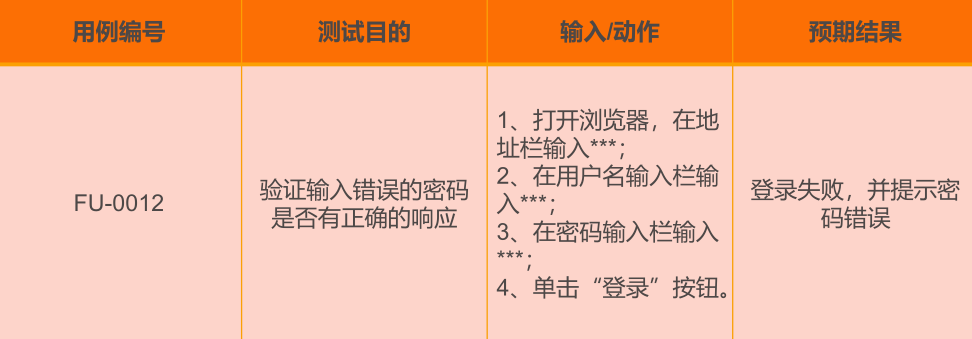

### 测试用例的元素

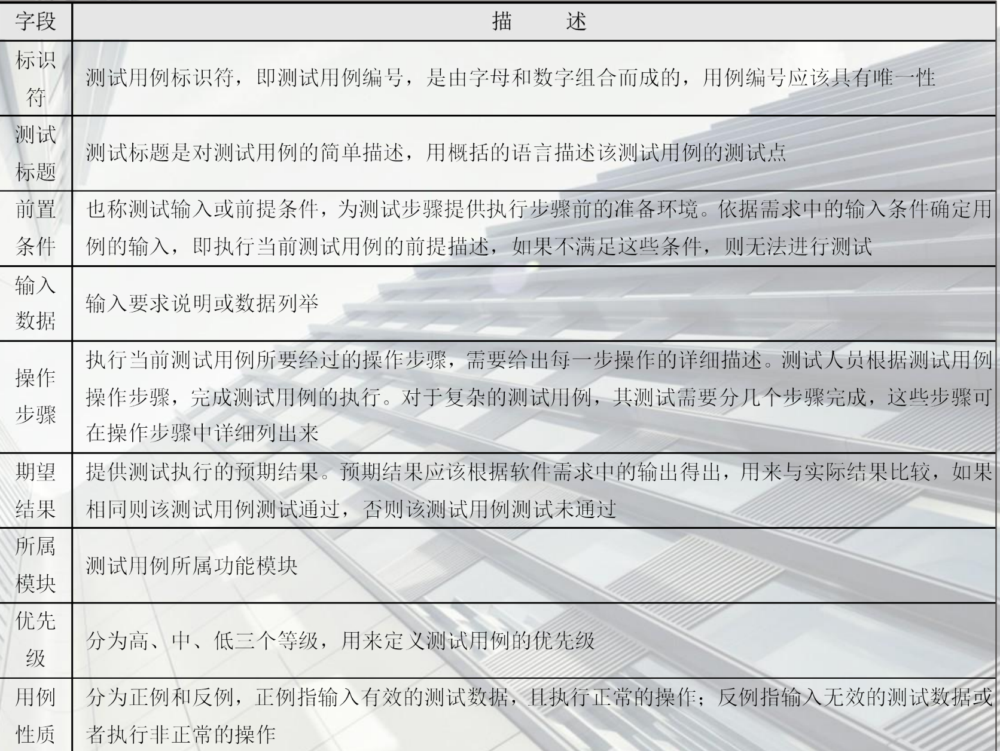

## 软件测试过程

### 单元测试

单元测试是指对软件中的最⼩可测试单元进⾏检查和验证。程序的多个模块可以并⾏地进⾏单元测试。

单元的质量是整个软件质量的基础，所以充分的单元测试是非常必要的。
通过单元测试可以更早地发现缺陷，缩短开发周期、降低软件成本。多数缺陷在单元测试中很容易被发现，但如果没有进行单元测试，那么这些缺陷在后期测试时就会隐藏得很深而难以发现，最终导致测试周期延长、开发成本急剧增加。

**如何进行单元测试**

主要⽤⽩盒测试，先静态地检查代码是否符合规范，然后动态地运⾏代码，检查其实是运⾏结果，以及程序的⾮法数据的容错性，程序的边界处理等。

**什么时候进⾏单元测试**

程序员编码之后，代码已经通过编译后进⾏单元测试。测试前期，还要撰写单元测试计划，编写单元测试⽤例。

**由谁来进⾏单元测试**

⽩盒测试⼯程师或开发⼈员。若是由开发⼈员来测试，最好做到交叉测试。避免⼜当裁判员⼜当运动员

**单元测试的依据**

1. 源程序本身，代码+注释
2. 《详细设计》⽂档

**单元测试的通过标准**

1. 程序通过所有的单元测试的⽤例
2. 语句覆盖率达到100%
3. 分⽀的覆盖率达到85%

**单元测试的⼀般步骤**

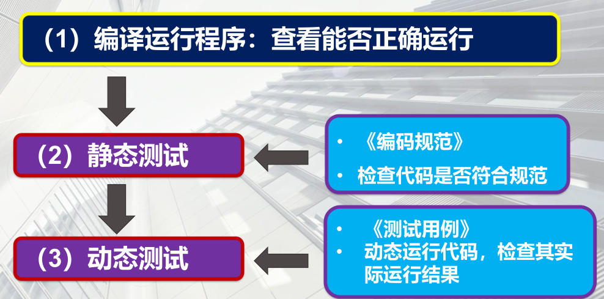

1. 编译运⾏程序：查看是否能正确运⾏
2. 静态测试
3. 动态测试

**单元测试要解决的任务**

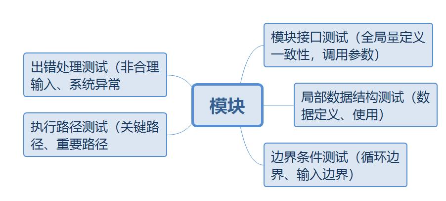

1. 出错处理测试
2. 执⾏路径测试
3. 模块接⼝测试
4. 局部数据结构测试
5. 边界条件测试

### 集成测试

集成测试是指将已通过测试的单元模块组装成系统或者是⼦系统，在进⾏测试，重点测试不同模块的接⼝部分。

集成测试就是⽤来检查各个单元模块结合到⼀起能否协同配合，正常运⾏。重点检查各个模块的接⼝部分，如函数之间的参数传递是否正确、全局变量的使⽤等。

**什么时候进⾏集成测试**

理论上：集成测试在单元测试之后，但是这样效率太低。

实际上：单元测试和集成测试同步进⾏，在单元测试中优先测试⼏个函数的功能，然后再集成测试⼀下这⼏个函数的接⼝（即参数传递）。

**由谁来进⾏集成测试**

⽩盒测试⼯程师或开发⼈员

**集成测试的依据**

1. 单元测试模块
2. 《概要设计》⽂档

**集成测试的⽅法**

● ⾮增量式集成测试⽅法：先分别测试每⼀个模块，再把所有模式按设计要求放在⼀起结合成所要的程序，也被成为⼤棒模式。

● 增量式集成测试⽅法：把下⼀个要测试的模块同已经测试好的模块结合起来进⾏测试，测试完以后把下⼀个应测试的模块结合起来进⾏测试

● 业界普遍采⽤增量式测试模式，也就是持续集成的策略

**增量式集成测试方法**

1、自顶向下集成测试
自顶向下集成法是从主控模块开始，沿着软件的控制层次向下移动，逐渐把各个模块结合起来。在自顶向下组装过程中，可以使用深度优先策略或宽度优先策略

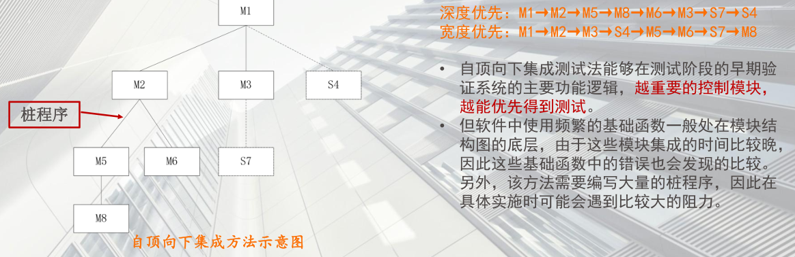

2、自底向上集成测试
自底向上集成测试是指从底层模块（即软件模块结构图中最低层的模块）开始，逐步向上不断集成模块进行测试的方法。

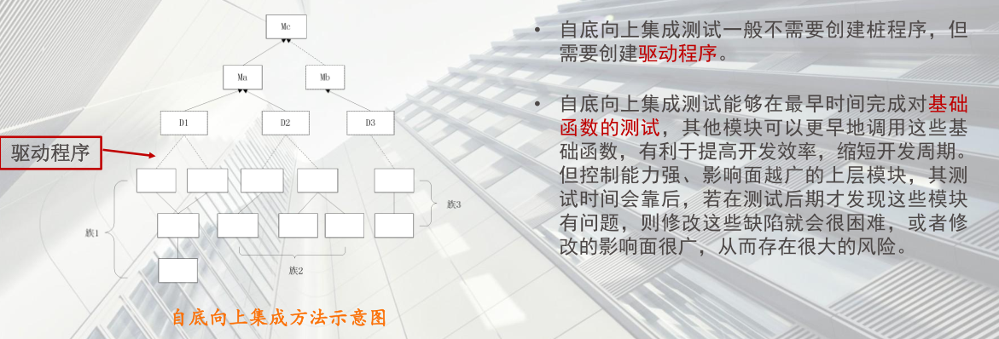

3、三明治集成-混合策略
在实际测试过程中，一般会将自顶向下集成测试和自底向上集成测试有机地结合起来，形成混合测试策略来完成软件系统的集成测试，这种混合测试策略可以发挥自顶向下集成测试和自底向上集成测试的优点，避免其缺点，从而有效地提高测试效率。

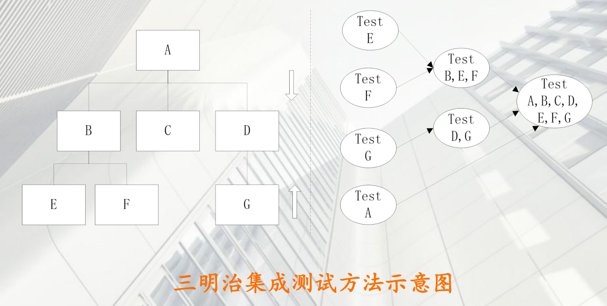

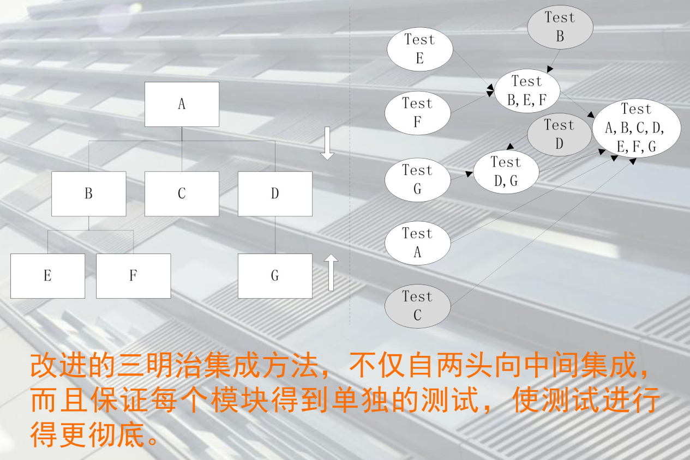

#### 确认测试

确认测试⽤于验证软件的有效性，验证软件是否满⾜需求规格说明书中列出的要求，即验证软件的功能及其他特性是否说⽤户的要求⼀致。

软件的功能要求再软件需求规格说明书中已经明确规定，即需求规格说明书包含的⽤户需求信息就是软件确认测试的基础。


### 系统测试

系统测试是指将整个软件系统看作⼀个整体进⾏测试，包括对功能，性能，以及软件所运⾏的软硬件环境进⾏测试。

主要由⿊盒测试⼯程师再整个系统继承完毕后进⾏测试，前期主要测试系统的功能是否满⾜需求，后期主要测试系统的性能是否满⾜需求，以及系统再不同的软硬件环境中的兼容性。

系统测试是验证软件产品是否符合这些质量特性要求的测试。系统测试包括性能测试、安全测试和兼容性测试等。

### 验收测试

验收测试指的是再系统测试的后期，以⽤户测试为主，或者有测试⼈员等质量保证⼈员共同参与的测试，它也是软件正式交给⽤户使⽤的最后⼀道⼯序。

重要性：涉及⽤户能否最终验收签字并付款

Alpha测试：由⽤户、测试⼈员、开发⼈员共同参与的内部测试

Beta测试：内测后的公测，即完全交给最终⽤户测试


### 其他测试

#### 回归测试

是指重新执⾏已经做过的测试的某个⼦集，以保证修改没有引⼊新的错误或发现由于更改⽽引起的之前未发现的错误，也就是保证改变没有带来⾮预期的副作⽤。

#### 冒烟测试

是指对⼀个新版本进⾏⼤规模的系统测试之前，先验证⼀下软件的基本功能是否实现，是否具备可测试性。

#### 随机测试

是指测试中的所有输⼊数据都是随机产⽣的，其他的⽬的是模拟⽤户的真实操作，并发现⼀些边缘性的问题

## 软件测试模型

#### v模型

V模型作为最典型的测试模型,由Paul Rook在20世纪80年代后期提出,如图所示V模型反映了测试活动与分析和设计的关系,明确标明了测试过程中存在的不同级别,弄清楚描述测试的各个阶段和开发过程的各个阶段之间的对应关系。V模型左侧是开发阶意,右侧是测试阶段。开发阶段先从定义软件需求开始,然后把需求转换为概要设计和详
细设计,最后形成程序代码。测试阶段是在代码编写完成以后,先从单元测试开始,然后是集成测试、系统测试和验收测试。


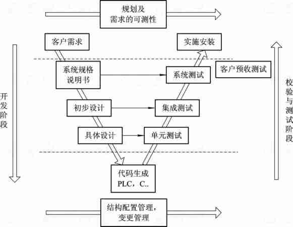

#### w模型

​	W 模型强调,测试伴随着整个软件开发周期,测试的对象不仅仅是程序,需求、设计等同样要测试,也就是说,测试与开发同步进行。W模型有利于尽早地发现问题,只要相应的开发活动完成,就可以开始测试。例如,需求分析完成后,测试就应该参与到对需求的验证和确认活动中,以尽早地找出缺陷所在。同时,对需求的测试也有利于及时了解项目难度和测试风险,及早制定应对措施,从而减少总体测试时间,加快项目进度。

​	W模型也存在局限性。在.W模型中,需求、设计、编码等活动被视为串行,测试和开发活动保持着一种线性的前后关系,上一阶段结束,才开始下一个阶段工作,因此,W模型无法支持迭代开发模型。

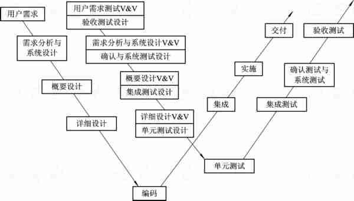

#### h模型

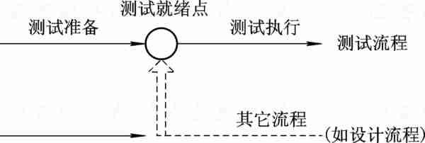

#### x模型

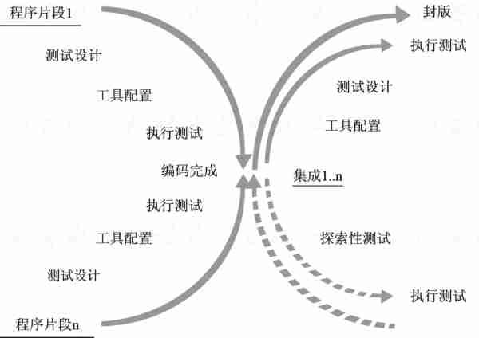


## 软件质量模型

**(衡量软件质量的维度)**

- 1. 功能性：与需求数量一致，功能正确 

- 2. 性能：响应快、占用资源少 

- 3. 兼容性：不同设备平台正常使用 

- 4. 易用性：用户体验好 

- 5. 安全性：敏感信息无泄密存储有保障 

- 6. 可靠性：持久运行无异常 

- 7. 可移植性：升级迁移数据不丢失 

- 8. 可维护性：出现异常恢复简单、可扩展功能、升级更新便捷

## 黑盒测试

### 什么是⿊盒测试

⿊盒测试指的是把被测的软件（对象）看作是⼀个⿊盒⼦，我们不关⼼⾥⾯的结构是什么样⼦的，只关⼼软件（对象）的输⼊数据和输出结果。


### 等价类划分法

#### 等价划分类的定义

等价划分法是把所有可能的输⼊数据，即程序的输⼊数据集合划分成若⼲个⼦集（即等价类），然后从每⼀个等价类中选取少量具有代表性的数据作为测试⽤例。

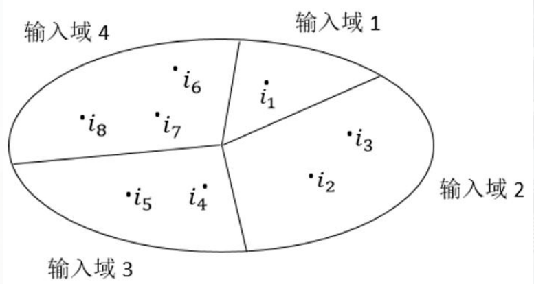


#### 有效/无效等价类

“**有效等价类**”是指完全满足产品规则说明的输入数据，即有效的、有意义的输入数据所构成的集合。利用有效等价类可以检验程序是否满足规则说明所规定的功能性要求。
 “**无效等价类**”和有效等价类相反，即不满足程序输入要求或者无效的输入数据构成的集合。

#### 等价划分原则

1. 规定输⼊数据的取值范围
2. 规定输⼊数据的集合
3. 规定输⼊数据的数值
4. 规定输⼊数据的规则
5. 完备性（就是整个输⼊域提供了⼀种形式的完整性）
6. ⽆冗余性（就是输⼊域划分为若⼲个⼦集合时互不相交）

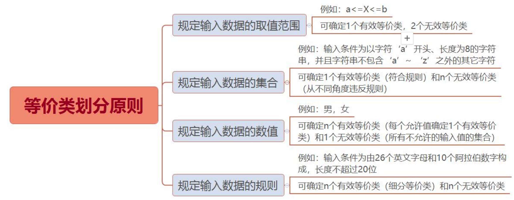

#### 使⽤等价类划分法的过程

1. 形成等价类表，每⼀等价类规定⼀个唯⼀的编号
2. 设计⼀测试⽤例，使其尽可能多的覆盖尚未覆盖的有效等价类，重复这⼀步骤，直到所有有效等价

​	类均被测试⽤例所覆盖

3. 设计⼀新测试⽤例，使其只覆盖⼀个⽆效等价类，重复这⼀步骤知道所有⽆效等价类，重复这⼀步

​	骤知道所有⽆效等价类均被覆盖（通常程序执⾏⼀个错误后不继续监测其他错误，故每次只测试⼀个⽆效类）


### 边界值分析法

#### 边界值分析法定义

边界值分析法就是对输⼊或输出的边界值进⾏测试的⼀种⿊盒测试⽅法。通常边界值分析法使作为对等价类划分法的补充，这种情况下，其测试⽤例来⾃等价类的边界。

#### 为什么使用边界值分析法？

无数的测试实践表明，大量的故障往往发生在输入定义域或输出值域的边界上，而不是在其内部。因此，针对各种边界情况设计测试用例，通常会取得很好的测试效果。

#### 如何确定边界值

1. ⾸先确定边界情况。通常输⼊或输出等价类的边界就是应该着重测试的边界情况

2. 选取正好等于、刚刚⼤于或刚刚⼩于边界的值作为测试数据，⽽不是选取等价类中的典型值或任意值

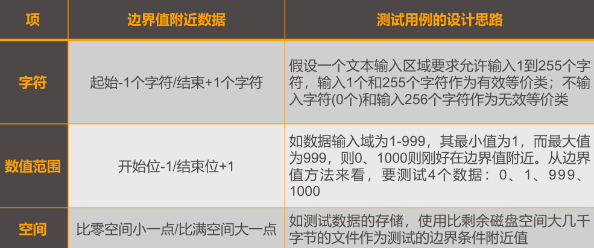

#### 一般性/健壮性边界值分析法

**一般性边界值分析法**：

- **基本概念**：这是一种基于“单故障”假设的黑盒测试方法，即假设软件中的故障主要是由单个变量的边界值引起的。
- **测试策略**：在设计测试用例时，只需要取一个变量的边界值（如最大值、最小值），而其他变量则保持正常值。
- **测试用例数量**：对于一个有n个变量的函数，使用一般性边界值分析法会设计出4n+1个测试用例。
- **示例**：假设有一个函数需要两个输入变量x和y，其边界值分别是1和10。则一般性边界值分析法的测试用例可能包括：x=1, y=5；x=5, y=1；x=10, y=5；x=5, y=10；以及x和y都取正常值的某个情况。

**健壮性边界值分析法**：

- **基本概念**：健壮性边界值法是一般性边界值法的一种扩展，它考虑了软件在面临最坏情况下的表现。
- **测试策略**：除了考虑变量的最小值、最大值外，还增加了略大于最大值、略小于最小值的两种情况。因此，对于每个变量，都会考虑七个值：最小值、略低于最小值的值、略高于最小值的值、中间值、最大值、略低于最大值的值、略高于最大值的值。
- **测试用例数量**：对于有n个变量的函数，使用健壮性边界值法会设计出6n+1个测试用例。
- **示例**：继续以上面的函数为例，健壮性边界值分析法的测试用例会包括更多边界条件，如x略小于1、x=1、x略大于1、...、x略小于10、x=10、x略大于10等，同样地，y也会有类似的边界条件组合。


### 决策表法

在所有的⿊盒测试⽅法中，基于决策表（也称判定表）的测试是最为严格、最具有逻辑性的测试⽅法

#### 决策表法的定义

决策表是分析和表达多逻辑条件下执⾏不同操作的情况的⼯具

#### 决策表的优点

能后将复杂的问题按照各种可能的情况全部列举出来，简明并避免遗漏。因此，利⽤决策表能够设计出完整的测试⽤例集合。

在⼀些数据处理问题当中，某些操作的实时依赖于多个逻辑条件的组合，即针对不同的逻辑条件的组合值，分别执⾏不同的操作。决策表很适合于处理这类问题。

#### 决策表通常由以下四个部分组成

1. 条件桩
2. 条件项
3. 动作桩
4. 动作项

#### 建立决策表步骤

在⼀些数据处理问题当中，某些操作的实施依赖于多个逻辑条件的组合，即：针对不同逻辑条件的组合值，分别执⾏不同的操作。决策表很适合于处理这类问题

##### 建立

1、列出所有的条件桩和动作桩
2、填⼊条件项
3、填⼊动作项，制定初始判定表
4、简化、合并相似规则或者动作

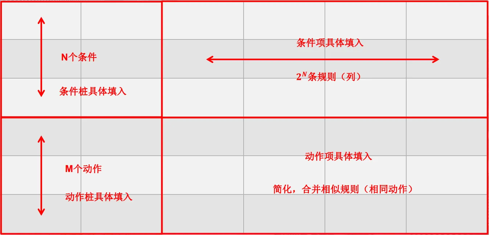

##### 规则的简化和合并

如果两条或多条规则的动作项相同，条件项只有⼀项不同，则可以将该项合并，合并后的条件⽤符号“-”表示，说明执⾏的动作与该条件的取值⽆关，称为⽆关条件。


### 因果图法

#### 因果图法定义

因果图法是⼀种利⽤图解法分析输⼊的各种组合情况，从⽽设计测试⽤例的⽅法，它适合于检查程序输⼊条件的各种组合情况


#### 因果图法中输⼊条件与输出结果之间的关系（4种）


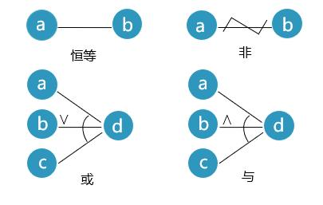

**等**

若原因出现，则结果出现；若原因不出现，则结果也不出现。
例如：若a = 1，则b = 1；若a = 0，则b = 0。

**非**

若原因出现，则结果不出现，若原因不出现，则结果出现
例如：若a = 1，则b = 0；若a = 0，则b = 1。

**或**

若⼏个原因中有⼀个出现，则结果出现；若⼏个原因都不出现则结果不出现。
例如：若a = 1或b = 1或c = 1，则d = 1；若a = b = c = d = 0，则d = 0。

**与**

若⼏个原因都出现，结果才出现；若其中有⼀个原因不出现，则结果不出现。
例如：若a = b = c = 1，则d = 1；若a = 0或b = 0或c = 1，则d = 0

#### 因果图中输⼊或输出的约束关系（5种）

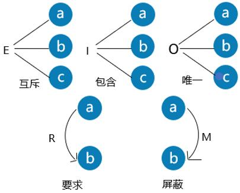


这种制约关系⼀般可以分为5类：互斥、包含、唯⼀、R约束（要求）、M约束（强制、屏蔽）

**互斥（异）**

表示a、b、c这三个原因不会同时成⽴，**最多有⼀个可能成⽴**

**包含（或）**

表示a、b、c这三个原因种**⾄少有⼀个必须成⽴**

**唯一**

表示a、b、c种必须有⼀个成⽴，且仅有⼀个成⽴

**R约束（要求）**

表示当a出现时，b也必须出现。例：若a = 1，则b必须为1

**M约束（强制、屏蔽）**

若a = 1，则b必须为0；⽽当a为0时，b的值不定。


#### 场景法

用例场景用来描述用例流经的路径，从开始到结束遍历整条路径上所有的基本流和备选流。
	• 基本流：按照正确的业务流程实现的一条操作路径（模拟正确的操作流程）。
	• 备选流：导致程序出现错误的操作流程（模拟错误的操作流程）。
在如图所示的操作流程中，可以确定以下场景：
场景1：基本流
场景2：基本流 备选流1
场景3：基本流 备选流1 备选流2
场景4：基本流 备选流3
场景5：基本流 备选流3 备选流1
场景6：基本流 备选流3 备选流1 备选流2
场景7：基本流 备选流4
场景8：基本流 备选流3 备选流4

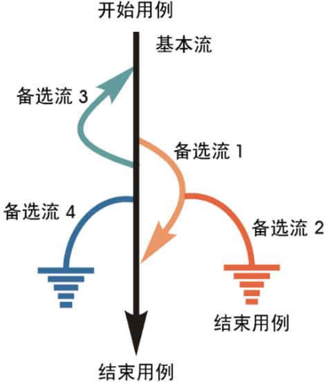


### 综合分析

• 对于业务流程清晰的被测系统，可以利用场景法贯穿整个测试案例过程，对主要业务流程进行测试。
• 当主要流程测完后，再对系统中的重要功能进行等价类划分测试，将无限测试变成有限测试，这是减少工作量和提高测试效率最有效的办法。
• 在任何情况下都必须使用边界值分析法。经验表明，用这种方法设计的测试用例发现程序错误的能力最强。
• 可以依靠测试工程师的智慧和经验追加一些测试用例。
• 对照程序逻辑，检查已设计的测试用例的逻辑覆盖程度。如果没有达到要求的覆盖标准，应当再补充足够的测试用例。
• 对于参数配置类的软件功能，要用正交试验法选择较少的组合方式达到最佳效果。

## 白盒测试

### 白盒测试定义

⽩盒测试⽅法就是根据模块内部结构，基于程序内部逻辑结构，针对程序语句、路径、变量状态等来进⾏测试。

单元测试主要采用白盒测试方法，辅以黑盒测试方法。白盒测试方法应用于代码评审、单元程序之中，而黑盒测试方法则应用于模块、组件等大单元的功能测试之中。


### 静态白盒测试

静态⽩盒测试是⼀种不执⾏程序⽽进⾏测试的技术，其关键功能是检查软件的表示和描述是否⼀致，没有冲突或者没有歧义。侧重于纠正软件系统在描述、表示和规格上的错误，是任何进⼀步测试的前提。

最常⻅的静态测试是找出源代码的语法错误，可由编译器来完成，因编译器可以逐⾏分析检验程序的语法，找出错误并报告。

除此之外，测试⼈员需采⽤⼈⼯⽅法来检验程序，有些地⽅存在⾮语法⽅⾯错误，只能通过⼈⼯检测的/⽅法来判断。

⼈⼯监测的⽅法主要有代码检查法、静态结构分析法等。

#### 代码检查法

```
#include<stdio.h>
max(float x,float y)
{
float z;
z=x>y?x:y;
return(z);
}
main()
{
float a,b;
int c,d;
scanf("%f,%f",&a,&b);
c=max(a,b);
printf("Max is %d\n",c);
}
```

必须修改的问题(3)
	– 程序没有注释
	– 子函数max没有返回值类型
	– 精度丢失问题
建议修改的问题(3)
	– main函数没有返回值类型和参数表(默认为void main (void))
	– 程序适当加一些空行
	– 程序中存在未使用的变量

#### 静态结构分析

通过各种图表对源程序进⾏静态分析，例如常⽤的关系图、控制流图 

- 函数调⽤关系图：列出所有函数，⽤连线表示调⽤关系，通过应⽤程序个函数之间的调⽤关系展示系统的结构。 

- 模块控制图：由许多结点和连接节点的边组成的图形，其中每个结点代表⼀条或多条语句，边表示控制流向，可直观反映出⼀个函数的内部结构。

  

### 动态白盒测试

动态白盒测试需要软件执行，当软件系统在模拟或真实环境中执行之前、之中和之后，对软件系统行为的分析是动态测试的主要特点。它显示一个系统在检查状态下是正确还是不正确。


### 逻辑覆盖法

逻辑覆盖法：通过对程序逻辑结构的遍历实现对程序的覆盖，它是一系列测试过程的总称。

逻辑覆盖法以不同的覆盖项作为测试标准。

覆盖项是指作为测试基础的一个入口或属性，比如语句、判定（分支）、条件等。


#### 语句覆盖（Statement Coverage）

要求：设计测试用例，使程序中的每个可执行语句至少被执行一次。

特点：语句覆盖是最基本的覆盖方式，但只能覆盖某一条路径，对于多分支的逻辑无法全面反映。

​	如果是顺序结构，就是让测试从头执行到尾。

​	如果有分支、条件和循环，需要利用下面的方法，执行足够的测试覆盖全部语句。

#### 判定覆盖（Decision Coverage）或分支覆盖

要求：设计测试用例，使程序中的每个判断的真假分支至少执行一次。

特点：判定覆盖保证了真假分支均被执行，但忽略了每个条件的取值情况。

#### 条件覆盖（Condition Coverage）

要求：设计测试用例，使判定语句中的每个逻辑条件取真值与取假值至少出现一次。

特点：条件覆盖关注每个条件的取值，但可能遗漏部分测试路径。

#### 判定/条件覆盖（Condition/Decision Coverage）

要求：设计测试用例，使判定语句中所有条件的可能取值至少出现一次，同时每个判定的所有可能结果也至少出现一次。

特点：判定/条件覆盖弥补了判定覆盖和条件覆盖的不足，但可能仍存在遗漏测试的情况。

#### 条件组合覆盖（Multiple Condition Coverage）

要求：设计测试用例，使判定语句中每个条件的所有可能取值组合都至少出现一次，同时每个判定语句的判定结果也至少出现一次。

特点：条件组合覆盖的覆盖范围最广，但当条件较多时，测试用例数量会呈指数型增长，降低测试效率。


### 基本路径测试法

路径测试就是从一个程序的入口开始，执行所经历的各个语句的完整过程。从广义的角度讲，任何有关路径分析的测试都可以被称为路径测试。

• 完成路径测试的理想情况是做到路径覆盖，但对于复杂性大的程序要做到所有路径覆盖（测试所有可执行路径）是不可能的。

• 在不能做到所有路径覆盖的前提下，如果某一程序的每一个独立路径都被测试过，那么可以认为程序中的每个语句都已经检验过了，即达到了语句覆盖。这种测试方法就是通常所说的基本路径测试方法。


#### 基本路径测试方法包括以下4个步骤：

（1）以详细设计或源代码作为基础，导出程序的控制流图G。

（2）计算控制流图G的圈复杂度V（G），导出程序基本路径集中的独立路径数目，这是确定程序中每个可执行语句至少执行一次所必须的测试用例数目的上界。

（3）确定程序的独立路径。

（4）生成测试用例，确保独立路径集中每条路径的执行。


## 功能测试

#### 测试类型

1. 逻辑功能测试
2. 界⾯测试
3. 易⽤性测试
4. 安装测试
5. 兼容性测试


## 性能测试

### 性能测试概念

- 性能测试就是测试在⼀定条件下系统⾏为表现是否符合需求规格的性能指标。

- 在性能测试之前要做好系统的备份

### 性能指标

#### 响应时间

- 对请求做出的响应所需要的时间。

- 案例：Web应⽤的⻚⾯响应时间

#### 并发⽤户数

- 并发⽤户：指某⼀物理时刻同时向系统提交申请的⽤户数

  - 第⼀：并发强调所有的⽤户必须在同⼀时刻对服务器进⾏施压

  - 第⼆：强调要与服务器进⾏数据交互

- 在线⽤户：指某段时间内访问系统的⽤户数，这些⽤户并不⼀定同时向系统提交请求。

#### 吞吐量

- 指在⼀次性能测试过程中，⽹络上传输数据量的总和。

- ⼀般来说，在系统设计范围之内，吞吐量随系统的并发⽤户数的增加呈现增加趋势

- 当超出了这个范围时有两种情况，⼀种是系统只能处理这么多，超过这个数系统就不接收了，最后随着并发⽤户数的增多吞吐量是⼀个⽔平的直线；还有⼀种情况是不管来多少系统都接收最后导致系统吞吐量下降甚⾄系统崩溃。

#### 性能计数器

- 描述服务器或者时操作系统性能的⼀些数据指标，如使⽤内存数、进程时间等，在性能测试中发挥着“监控和分析”的作⽤

#### 资源利⽤率

- CPU占⽤率、内存占⽤率、磁盘占⽤率、⽹络等。

- 资源利⽤率表现当前服务器资源使⽤的情况，它是分析服务器出现瓶颈和对服务器进⾏调优的主要依

- 据，在配置调优测试的过程中，通过⽐较配置调优前后系统资源的使⽤率来判断调优的效果。

#### 思考时间

- 也称为“休眠时间”，是指⽤户在进⾏操作时，"每个请求之间的时间间隔。

- 对于交互系统来说，⽤户不可能持续不断地发出请求，⼀般情况下，⽤户在向服务端发送个请求后，会等待⼀段时间再发送下⼀个请求。性能测试过程中，为了模拟这个过程⽽引⼊思考时间的概念。

- 在测试脚本中，思考时间为脚本中两条请求语句之间的间隔时间。当前对于不同的性能测试⼯具提供了不同的函数来实现思考时间，在实际的测试过程中，如何设置思考时间是性能测试⼯程师需要关⼼的问题。

#### 点击率

- 是指每秒钟⽤户向服务器提交的HTTP数量。

- ⽤户每点击⼀次，服务器端就要对⽤户提交的请求进⾏⼀次处理;对于Web 系统来说，点击率是服务器处理的最⼩单位，点击率的值越⼤，说明服务器端所能承受的压⼒越⼤。

- 通常情况下，Web 服务器都具有防刷新的机制，因为客户每刷新⼀次系统就要响应⼀次点击，如果不对服务器进⾏防刷新处理，当⽤户不停地单击刷新按钮，此时服务器将承受着巨⼤的压⼒。

### 性能测试方法

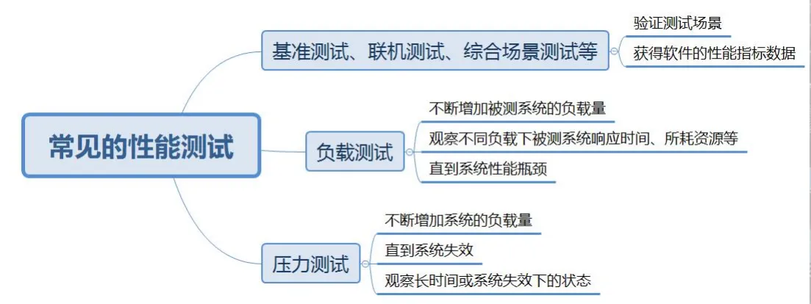

1. 基准测试（Benchmark Test）
   - **目标**：衡量计算机系统、软件应用或硬件组件的性能，通过运行标准化的任务场景来测量系统的性能表现，帮助评估系统的各种指标如响应时间、吞吐量、延迟、资源利用率等。
   - **执行方式**：运行一系列标准化的任务场景，记录和分析系统的性能数据。基准测试的结果可以用于比较不同系统、不同配置或不同实现之间的性能差异，或者在系统发生变化后评估性能的改进或下降。
2. 并发测试
   - **目标**：评估系统在多个用户同时访问或操作时的性能表现，确保系统能够处理高并发的用户请求。
   - **执行方式**：确定测试目标，如性能评估、容量规划等；制定测试计划，确定测试范围、数据准备、测试环境等；选择适合的并发测试工具，如Apache JMeter、LoadRunner等；设置合适的测试场景，模拟真实的用户行为；执行测试并记录性能数据、错误日志等；分析测试结果，找出问题和改进方向。
3. 联机测试（分布式测试，多机联合测试）
   - **目标**：使用多台测试机联合产生更大的并发用户数，模拟真实环境下多个用户对系统的访问，以评估系统的性能和稳定性。
   - **执行方式**：使用多台测试机模拟大量用户同时访问系统，测试系统的性能表现和稳定性。联机测试需要考虑网络条件、硬件配置、操作系统等多个因素。
4. 综合场景测试
   - **目标**：模拟真实环境中可能出现的各种复杂场景，对系统进行全面的性能测试，以评估系统在不同场景下的性能表现和稳定性。
   - **执行方式**：根据实际应用场景设计多种测试场景，包括压力测试、负载测试、稳定性测试等，对系统进行全面的性能测试。在测试过程中，需要监控系统的性能指标和资源使用情况，并根据测试结果进行性能分析和优化。
5. 负载测试
   - **目标**：评估系统在不同负载下的性能和稳定性，确定系统的瓶颈和容量。
   - **执行方式**：指定并发数对系统进行多次测试，或者是在系统不断增加压力的过程中，监控系统资源和各项指标，找出性能瓶颈。负载测试可以帮助确定系统可以处理的最大负载和容量，以便规划系统的容量和资源需求。
6. 压力测试
   - **目标**：在超过系统正常负载的情况下，对系统不断施加压力，以评估系统的最大服务级别和恢复能力。
   - **执行方式**：在超过安全负载的情况下对系统施加压力，确定一个系统的瓶颈或不能接收用户请求的性能点。压力测试可以帮助识别潜在的性能瓶颈、确保系统的可靠性和可伸缩性，并验证系统在极端条件下的恢复能力。


#### 负载测试：(寻找最大值)

- 方法：通过对系统不断的加压，直到超过预定的指标或者部分资源达到一种饱和状态不能再加压为止。主要用于找到系统最大的负载能力，为性能调优提供数据。

- 工具：JMeter、LoadRunner、Gatling、WebLOAD等。

#### 压力测试：(求稳定性)

- 方法：测试系统在一定饱和状态下（如CPU、内存等资源高负荷使用）的性能和稳定性，观察系统是否会出现错误。

- 工具：LoadRunner、WebLOAD等，这些工具能模拟大量用户同时访问，以测试系统的抗压能力。

#### 基准测试：

- 方法：在一定的软件、硬件和网络环境下，模拟一定数量虚拟用户运行一种或多种业务，将测试结果作为基准线数据，用于后续的调优或系统评测。

- 工具：JMeter、LoadRunner等，这些工具能模拟多种业务场景并生成基准线数据。


## 接口测试


## 软件测试分类

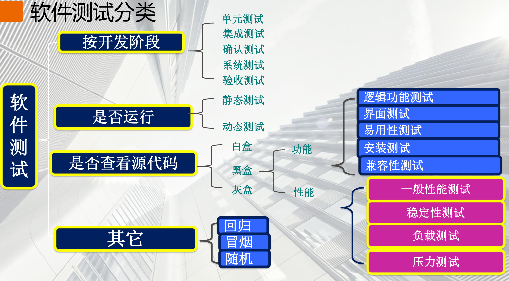

#### 按照是否运行分类

**静态测试**

指的是不实际运⾏被测试的软件，⽽只是静态的检查程序代码、界⾯或者⽂档中可能存在的错误的过程

**动态测试**

实际运⾏被测试程序，输⼊响应的测试数据，检查实际的输出结果和预期的输出结果是否相符的过程。

判断⼀个测试属于动态测试还是静态测试，唯⼀的标准是看是否运⾏程序。

#### 按照测试类型分类

- 界面类测试

- 安全性测试

- 文档测试

#### 按照测试过程分类

- 单元测试

- 冒烟测试

- 集成测试
- 确认测试

- 系统测试

- 验收测试

#### 按照测试技术分类

- 黑盒测试

- 白盒测试

#### 按照软件质量特性分类

- 功能测试
  - 自动化测试工具：如Selenium、Watir等，用于模拟用户操作，自动执行测试用例，检查软件功能是否正确。

- 性能测试
  - 自动化测试工具：如LoadRunner、JMeter等，用于模拟大量用户并发访问，测试软件的性能表现，如响应时间、吞吐量等。

- 接口测试

- 安全测试

#### 按照自动化程度分类

- 手工测/试

- 自动化测试
  - Selenium：一款功能强大的自动化测试工具，支持多种浏览器和操作系统，适用于Web应用的测试。

#### 按照界面显示分类

- web

- 桌面

  - win

  - mac

- app

  - android

  - ios

